# Base2026 Cloudflare Pipeline — Canonical Architecture and Operating Manual

Status: authoritative architecture and operations reference

Public production verified: 2026-08-31 (first recurring data-only guide run; unchanged runtime).
Private production verified: 2026-08-30 (separate owner's compatible editorial adapter; application label remains v0.6.4).

Applies to: TikTok discovery, cloud acquisition, private processing, automatic excerpt-card publication, public Base2026 search, deployment, rollback, and agent handoff

> **All agents start here for Base2026 Cloudflare or TikTok-pipeline work.** Repository files and live Cloudflare receipts override chat memory. This document defines the system; dated counters and version IDs are only a verified snapshot and must be refreshed before a production change.

## Latest editorial operation — 2026-08-31

The first recurring office run published four independently reviewed guides
through the existing publisher, without deploying a Worker or altering intake.
All five registered guides now have revision 1. Remote read-only D1 verification:
six editorial records/six receipts/five guides/zero orphan receipts; blog/RSS
retain three articles. Each new live API payload matches its reviewed hash.
Source corpus remains 2175 documents/1574 sources/50 routes/83 cards/zero full
transcripts. Signed control-plane health is healthy 0.6.4 with broad/local false;
this is not a new R2 or daily intake audit.

Live deployment inventory still selects `a63f4c74-b6b2-4935-a392-61003d28567a`
at 100%. The existing six-hour office's first updated run is now observed.
Five X publications are scheduled, not five new live posts; only changed guide
URLs were sent to IndexNow. GSC discovery and traffic remain separate metrics.
No private Worker, schema, credential, design, Git or platform-access change.
[Exact data-only run](project-memory/BASE2026_EDITORIAL_OFFICE_RUN_2026_08_31.md).

## Historical maintained-guide extension — 2026-08-30

Public Worker `a63f4c74-b6b2-4935-a392-61003d28567a` serves reviewed tree
`fa3626039508a4ab4a483044c8336b93a8f63eebb3798bcc46c3e8b15620aa39`.
No new public migration: the existing editorial publisher/tables now support
maintained `evidence_guide` records at registered topic canonicals. A guide
binds short supporting quotes to exact public document hashes. Publication and
public reads recheck identity/admission/dependencies; drift holds the guide
for repair. Semantic review remains separate from structural/hash checks.

The first internal-link guide was published at 23:34:41.154 UTC; one deliberate
replay made no duplicate. At that checkpoint D1 had two editorial records/two receipts,
while blog/RSS stay at three articles. Guide API and sitemap are separate and
read-only/no-store. The catalog now reaches all 50 cloud-added source records
over 30/20 pages, preserving 80 labeled legacy entries. Source corpus is unchanged.

The private owner separately deployed only its compatible adapter as version56
`4af232c8-27b5-4be1-a4e2-bf9593abed32`; rollback
`9b72420c-e963-4d52-b67b-f49c4bec6534`. Configuration, bindings, Container,
intake gates, credentials, migrations and Instagram code were unchanged. The
application label intentionally remains0.6.4; deployed UUID is authoritative.

Pre-guide public Worker versions cannot safely read guide-kind records in the
shared table. Restore a verified compatible version; never delete data/receipts
to run an old build. The existing six-hour editorial office was updated, not
duplicated. It is host-dependent for authoring/review/refill; Cloudflare serving
and durable publication are cloud-native. This does not alter the intake lane.

Instructions: [evidence-to-SEO operating manual](BASE2026_EVIDENCE_TO_SEO_OPERATING_MANUAL.md),
[shared publisher](BASE2026_EDITORIAL_PUBLISHING.md),
[live release proof](project-memory/BASE2026_EVIDENCE_SEO_RELEASE_2026_08_30.md).
GSC guides sitemap is Success/1 discovered page; discovery is not new traffic.

## Historical first-blog editorial extension — 2026-08-30

Public Worker `2b1a1c19-a9ab-4c43-b4b6-973678d9ee07` serves the reviewed
artifact `1d0220c8392aa36e712b7a2f0ffb2a718fa5b807d993157e6f3cbff58629ec92`;
rollback is `d242f1aa-60f5-4ff5-97af-883318173027`. Additive public migration
0004 creates separate article/receipt tables. The private owner deployed
v0.6.4 `9b72420c-e963-4d52-b67b-f49c4bec6534` with rollback
`ba61607a-0748-4cd4-877d-9dd863f097e1`, preserving prior intake/projection gates.

The existing service binding now also accepts reviewed original editorial
packets through an admin-HMAC-only receiver. This is separate from the TikTok
production-packet and excerpt-card lane below. `/blog`, article HTML, public
read-only API, RSS and the independent blog sitemap read validated public D1.
One real article was published and replayed: one article, one receipt, no
duplicate; public corpus remains 2175/1574/50/83/zero full transcripts.

Sol Max authoring/review is host-dependent; public serving and durable writes
are cloud-native. New source research does not turn a TikTok-only adapter into
Instagram/YouTube support. Daily private receipts currently show media and
transcripts but zero new production packets; healthy control-plane transport
must not be reported as a successful end-to-end daily content run.

See [editorial contract](BASE2026_EDITORIAL_PUBLISHING.md) and
[exact release/readback](project-memory/BASE2026_EDITORIAL_RUNTIME_RELEASE_2026_08_30.md).
Historical snapshots below explain prior releases; do not deploy their versions
as if they were the latest state.

## Historical public technical release — 2026-08-30

Public Worker `eeeabd1b-7454-4ec5-9ac3-6b35d3bb3fa3` is live at 100%.
Immediate rollback is `3e06c10b-9fa4-40aa-ad14-913a11b85f30`; artifact tree is
`02dc9883597dfab6215cb10b2082c19c804fda21bbbc3e71fe882a2d273a3065`.
The release keeps `/sources/*` Worker-first for consistent canonical 308
redirects and security headers, removes the noindex Workspace from the hub
sitemap, fixes JSONL cache/API discovery and deterministically overlays the
current Cloudflare roadmap. The builder preserves the Workspace Project Story
link and does not replay its own generated metadata. Public D1, reviewed JSONL,
homepage, founder and Workspace content remain unchanged. No private Worker,
schema, binding, DNS or intake action was part of the release. Exact source and
verification: [`release receipt`](project-memory/BASE2026_TECHNICAL_RELEASE_2026_08_30.md).

## Historical private capture receipt — 2026-08-29

The private control Worker is deployed as version
`14adacb6-7f0f-4aa7-9131-fc41469eec15` (v0.6.2). Its private Container uses
capture build 0.5.5 (application version 8). Cloudflare
reports one active/running instance, no failed instance and no errors; the
detail counter still reports `healthy=0`. Treat that mismatch as telemetry to
observe, not as a restart trigger without an active lease, explicit error or
real Container-required capture failure. The Container has no cookies,
account, browser profile, proxy, or public route.

Private D1 contains 339 sources and records 318 stored-media artifacts; direct
R2 aggregation also returns exactly 318 media objects (1,280 objects total).
No stale lease, failed/dead job or Queue delivery failure was found. Automatic
publication has 19 applied plus 1 already-public receipt, no pending/retry/held
receipt, and zero currently eligible candidates. The scheduled cadence is
unchanged: capture/reconcile every five minutes and discovery daily at 10:00
UTC. `PUBLIC_RELEASE_ENABLED=false` remains correct; the narrow policy-bound
projection lane remains enabled.

## 1. The short version — TikTok intake lane

The TikTok intake/projection lane has a cloud-only production path; the MacBook
is not required for that scheduled run. This does not describe the separate
Sol Max editorial authoring/review office above, which remains host-dependent.

1. Cloudflare discovers new TikTok video IDs from the registered creator list.
2. D1 rejects duplicates and admits only bounded, normalized TikTok sources.
3. Cloudflare first validates the official Player API, then uses a bounded Browser Player-API transport fallback only when needed; a private Container uses the canonical source URL only as the final bounded acquisition fallback, converts the media to audio, and R2 stores the private artifact.
4. Workers AI transcribes the audio and produces a strictly validated evidence selection.
5. Deterministic code builds Source Intelligence, Editorial, and Production Packet artifacts. Invalid or weak material stays private.
6. A pinned machine-publication policy imports eligible packets into the private materialized layer.
7. A Worker service binding sends only one to three sanitized excerpt cards to the public Worker.
8. The public Worker writes the cards to public D1 FTS5 and verifies the exact projection.
9. `base2026.dev` exposes those cards through the existing search API and site. Raw audio, full transcripts, private packets, credentials, and local paths never cross the boundary.

The important exception is ChatGPT Pro: it remains an optional, manual owner-initiated courier. No Worker signs in to ChatGPT, scrapes ChatGPT Web, or depends on it for the scheduled production path.

## 2. Source-of-truth hierarchy

Use sources in this order:

1. Live Cloudflare deployments, D1 readbacks, health responses, and signed receipts for current runtime state.
2. Deployed Worker source and Wrangler configuration in the protected operational checkout.
3. This manual for architecture, ownership, boundaries, and operating procedure.
4. `docs/project-memory/` for dated decisions, handoffs, and historical receipts.
5. Chat history only as a hint.

For a production mutation, never rely on a version number or counter copied from this file. Re-run the read-only checks in section 14.

### Source synchronization warning

The public GitHub repository contains the merged public-site Worker baseline,
startup release inputs, projection boundary, and `www` redirect through the
reviewed public-source merges. The August 30 growth-office runtime and article
delta is deployed but still uncommitted/unpushed; HEAD alone does not reproduce
that release. Its exact boundary is recorded in
[`BASE2026_EDITORIAL_RUNTIME_RELEASE_2026_08_30.md`](project-memory/BASE2026_EDITORIAL_RUNTIME_RELEASE_2026_08_30.md).
The private control-plane Worker remains in the
protected operational checkout and is intentionally not public source. A
generated live corpus artifact is also not reproduced by a clean clone. This
manual documents the production architecture, but it is not permission to
publish the private implementation or generated corpus.

Consequences:

- absence of `base2026-pipeline-control` from a fresh public clone does not mean the Worker is inactive;
- do not deploy from a clone or branch that predates current public `main`, and
  always recheck live deployments plus D1 migration state before a mutation;
- any future source synchronization requires its own public/private and secret review.

## 3. System map

```mermaid
flowchart LR
  T[TikTok public creator pages] --> BR[Cloudflare Browser Rendering\ndiscovery]
  BR --> PC[base2026-pipeline-control\nprivate Worker]

  subgraph Private[Private Cloudflare control plane]
    PC --> D1P[(PIPELINE_DB\nprivate D1 state)]
    PC --> PA[Player API\ndirect then Browser fallback]
    PA --> C[CAPTURE_CONTAINER\nprivate media-to-audio]
    C --> R2[(PIPELINE_ARTIFACTS\nprivate R2)]
    R2 --> QAI[PIPELINE_AI_JOBS]
    QAI --> WAI[Workers AI\nWhisper + Llama guard]
    WAI --> WF[Queues + Workflow\nreceipts and state transitions]
    WF --> D1P
    D1P --> AP[Machine publication policy\nexact eligible tuple only]
  end

  AP -->|PUBLIC_PROJECTION service binding RPC| PW[base2026\npublic Worker]
  PW --> D1S[(DB\npublic D1 FTS5)]
  PW --> AS[Static Assets]
  D1S --> SITE[base2026.dev\nWorkspace and search API]
  AS --> SITE

  WWW[www.base2026.dev] --> REDIR[base2026-www-redirect] --> SITE
  CHAT[ChatGPT Pro manual use] -. optional owner-mediated side lane .-> COURIER[Local private filesystem courier\nvalidation and lineage checks]
  COURIER -. authenticated reviewed intake only .-> PC
  MAC[Mac local adapter] -. rollback only; disabled .-> PC
```



## 4. Worker inventory

| Worker | Responsibility | Public surface | Authoritative bindings |
| --- | --- | --- | --- |
| `base2026` | Serves the startup site and Workspace, executes D1 FTS5 search, accepts Support/Partner forms, and exposes the private `PublicProjectionEntrypoint` RPC class | `base2026.dev`, public APIs and static assets | `ASSETS`, `DB`, `INBOX_DB`, `OUTREACH_DB` |
| `base2026-pipeline-control` | Owns discovery, admission, capture, private artifacts, queues, workflows, Workers AI, machine publication, retention, receipts, and private admin operations | Minimal health endpoint; all control operations are HMAC-authenticated | `PIPELINE_DB`, `PIPELINE_ARTIFACTS`, `PIPELINE_JOBS`, `PIPELINE_AI_JOBS`, `PIPELINE_WORKFLOW`, `AI`, `BROWSER`, `CAPTURE_CONTAINER`, `PUBLIC_PROJECTION` |
| `base2026-www-redirect` | Preserves path and query while sending `www` to the canonical apex | `www.base2026.dev` | No database or storage binding |

Adjacent infrastructure that must not be confused with the video pipeline:

- Cloudflare DNS and the apex custom domain route the Base2026 site.
- Google Workspace is the mail authority for `base2026.dev`; Cloudflare Email Routing is intentionally off.
- `INBOX_DB` contains private form submissions, not TikTok pipeline state.
- `OUTREACH_DB` is a separately curated public research collection, not the Evidence pipeline database.
- The old VPS/Meilisearch installation is rollback infrastructure, not the active search authority.

## 5. Cloudflare resources and why each exists

### Private control plane

| Binding or resource | Purpose | Critical rule |
| --- | --- | --- |
| `PIPELINE_DB` / private D1 | Authoritative sources, registry, jobs, leases, cursors, receipts, budgets, release state, and audit events | D1 state is authoritative; R2 and Queue messages are not a second state machine |
| `PIPELINE_ARTIFACTS` / private R2 | Media, manifests, transcripts, and private stage packets | No public domain; objects have retention classes and deletion receipts |
| `PIPELINE_JOBS` | Small deterministic work pointers for general pipeline jobs | Messages carry IDs and tokens, never artifact bodies |
| General DLQ | Exhausted general Queue deliveries | A DLQ receipt is a terminal operational problem, not permission to skip work |
| `PIPELINE_AI_JOBS` | Serialized transcription and semantic work | Batch size and concurrency are one to protect the AI budget |
| AI DLQ | Exhausted AI deliveries | Provider and contract failures remain private |
| `PIPELINE_WORKFLOW` | Resumable per-job orchestration with named steps and retries | Workflow steps re-read durable D1 state and fail closed |
| `AI` | Workers AI inference | Only allowlisted Whisper and Llama models are accepted |
| `BROWSER` | Creator discovery and bounded Player API transport fallback | It does not automate ChatGPT and is not an anti-bot bypass |
| `CAPTURE_CONTAINER` | Downloads an approved TikTok media URL and emits bounded `audio/ogg` | Private binding only; restricted egress, no cookies, non-public direct route |
| `PUBLIC_PROJECTION` | RPC service binding to `PublicProjectionEntrypoint` on `base2026` | The publication operation is not exposed as a public HTTP endpoint |
| `INTAKE_HMAC_SECRET` | Authenticates bounded intake operations | Secret value exists only in Cloudflare Secrets/private clients |
| `ADMIN_HMAC_SECRET` | Authenticates admin, status, release, and projection operations | Never place it in Git, logs, examples, or URLs |

### Public product plane

| Binding or resource | Purpose | Critical rule |
| --- | --- | --- |
| `ASSETS` | Built public Base2026 website | Generated release tree is deployable but not committed wholesale |
| `DB` | Public Evidence documents, topics, FTS5 index, projection receipts, and excerpt cards | It has no raw-media or private-packet schema |
| `INBOX_DB` | Private Support and Partner proposals | Separate retention and consent contract; not searchable evidence |
| `OUTREACH_DB` | Curated Outreach findings and FTS | Separate collection and admission process |

Official platform references: [Workers](https://developers.cloudflare.com/workers/), [service binding RPC](https://developers.cloudflare.com/workers/runtime-apis/bindings/service-bindings/rpc/), [Cron Triggers](https://developers.cloudflare.com/workers/configuration/cron-triggers/), [D1](https://developers.cloudflare.com/d1/), [R2](https://developers.cloudflare.com/r2/), [Queues](https://developers.cloudflare.com/queues/), [Workflows](https://developers.cloudflare.com/workflows/), [Workers AI](https://developers.cloudflare.com/workers-ai/), [Browser Rendering](https://developers.cloudflare.com/browser-rendering/), and [Containers](https://developers.cloudflare.com/containers/).

### Deliberately unused or limited products

| Product | Decision |
| --- | --- |
| Pages | Not used for the active site; Workers Static Assets is the serving model |
| KV | Not authoritative enough for leases/receipts; D1 owns durable state |
| Durable Objects | Used only as the Container runtime binding; no second pipeline state machine |
| Analytics Engine | Not required at current scale; Worker observability plus D1 receipts are authoritative |
| Vectorize | Not required for current exact identity, hashes, and FTS5 search |
| Stream | Not used; Base2026 does not re-host public video |
| AI Gateway | Disabled; there is no external paid-provider fallback |
| Cloudflare Email Routing | Disabled because Google Workspace owns mail |
| ChatGPT Web automation | Prohibited by the project contract; manual courier only |

All three Workers have Cloudflare observability enabled. Logs are privacy-safe operational events, not an artifact store, and are never copied wholesale into GitHub.

## 6. Scheduled runtime

The deployed private Worker has two Cron expressions.

| Cron | What always runs | Additional work |
| --- | --- | --- |
| `*/5 * * * *` | General job reconciliation, retention maintenance, and AI reconciliation | Up to three cloud captures, then an automatic-publication batch |
| `0 10 * * *` | General job reconciliation, retention maintenance, and AI reconciliation | Daily creator discovery and bounded admission at 10:00 UTC |

The automatic-publication batch is capped at 10 candidates. Each receipt can be attempted at most four times. These are concurrency and safety bounds, not a one-video-per-day business limit. A discovery run can admit up to 100 fresh IDs, and repeated future runs continue processing the durable backlog within compute and AI budgets.

### Configured capacity and safety bounds

| Area | Deployed/software bound |
| --- | --- |
| Discovery | At most 100 configured creators, 10 videos per creator, and 100 admissions per run |
| Browser discovery | 45-second total bound, 20-second navigation bound, 512 KiB response, 1,000 links |
| Cloud capture | At most 3 sources per five-minute reconcile |
| Player transport | 20-second direct timeout; 45-second Browser fallback; 1 MiB JSON |
| Artifact intake | 50 MiB per artifact, 32 artifacts per source |
| Workers AI audio | 10 MiB admitted to the AI call |
| General Queue | Batch 5, retry limit 3, consumer concurrency 2, separate DLQ |
| AI Queue | Batch 1, retry limit 2, consumer concurrency 1, separate DLQ |
| Automatic publication | Batch 10, four attempts, ten-minute fenced lease |
| Retention maintenance | 25 deletions per run; 24-hour orphan grace |
| R2 retention classes | Media/raw AI 7 days; review/production 30 days; synthetic fixture 1 day |
| Monthly cloud software defaults | 25 GiB-hours memory, 375 vCPU-minutes, 200 GiB-hours disk, 10 Browser-hours; reservation hard-hold begins at 80% |

The monthly values are software defaults, not a claim about Cloudflare plan allowances. The initialized D1 budget ledger is the runtime authority and may be deliberately lower.

## 7. End-to-end data flow

### 7.1 Creator registry and discovery

1. `discovery_creators` contains normalized, enabled, private-only TikTok creators.
2. The Worker tries the server-rendered embed first. Browser Rendering is a
   stateless, document-only fallback with JavaScript off, no cookies, no
   screenshots/recording, no raw response persistence, and an exact request
   allowlist.
3. The Worker normalizes the handle, numeric video ID, canonical URL, ordinal, and metadata.
4. A deterministic snapshot hash and run ID make replay observable.
5. `known_source_registry` and previous run items remove duplicates.
6. Fresh candidates are admitted in a bounded set; excess candidates are deferred, not discarded.
7. Only genuine browser-discovered TikTok admissions receive `publication_eligible=1`. Admin-seeded and synthetic rows default to ineligible.

### 7.2 Cloud acquisition

1. Every five minutes the capture reconciler selects at most three admitted sources without stored media.
2. The Worker requests TikTok's Player API directly.
3. Browser Rendering is used only for bounded transport fallback after a direct network failure; parse or security errors do not trigger a fallback.
4. The returned identity and media URL must exactly match the admitted source.
5. `CAPTURE_CONTAINER` fetches only an allowlisted HTTPS media host, strips authorization and cookies, and converts the input to bounded OGG audio.
6. The Worker verifies content type, size, and SHA-256 before writing the private object to R2.
7. D1 records the artifact, source transition, budget usage, and Queue pointer.

The direct manual Container-capture feature flag is off. Scheduled Player acquisition still uses the private Container after the Worker has obtained and validated the media URL. Those two facts are compatible and must not be conflated.

### 7.3 Workers AI

1. `PIPELINE_AI_JOBS` serializes AI work with one-message batch and one consumer.
2. `@cf/openai/whisper-large-v3-turbo` transcribes bounded private audio.
3. The raw transcript remains private in R2/D1.
4. `@cf/meta/llama-3.1-8b-instruct-fp8-fast` returns one strict JSON classification plus an evidence selection.
5. Retention requires label `retain`, confidence at least `0.85`, valid continuous evidence ranges, and one to three cards.
6. Schema, model, response, byte, token, and daily Neuron checks run before downstream state changes.
7. Daily software caps are 7,500 Neurons soft and 9,000 hard. Soft-cap
   overflow is recorded as held/deferred and is resumed to `pending` only after
   the next UTC budget day; no paid fallback is enabled.

`AI_GATEWAY_ENABLED=false` is intentional. D1 receipts and hard software accounting are the current spend-control authority.

### 7.4 Deterministic private packets

Accepted semantic output is converted into versioned, hash-bound artifacts:

1. `source_intelligence`;
2. `editorial` with decision `ADMIT_PUBLIC`;
3. `production_packet` with source identity, public-safe text, admitted excerpt cards, questions, and exact evidence lineage;
4. a `release_receipt`, still private and held;
5. a deterministic private import whose source and cards remain `held_private` with `public_release_enabled=0`.

Weak classification, low confidence, invalid JSON, omitted timestamp words, privacy risk, missing audio, identity mismatch, or unsupported content results in a private hold or rejection. The system does not manufacture a publishable packet to keep throughput numbers high.

### 7.5 Automatic publication

The dedicated lane is authorized by policy `base2026.machine-publication.v1`, scope `registered_tiktok_excerpt_cards`, and a pinned owner-authorization reference. Its stored policy hash must match the Worker configuration.

A candidate must satisfy all of the following:

- a real normalized TikTok source and canonical URL;
- exact joins among source, registry, enabled creator, latest production artifact, and release receipt;
- explicit `publication_eligible=1`;
- private registry/creator posture and no rejected authorization;
- no synthetic fixture artifact;
- an eligible source/release status and no conflicting prior projection;
- exact source, release, import, manifest, content, and receipt hashes.

For each claimed candidate, the Worker executes:

```text
release review as machine policy
  -> deterministic private import
  -> inspect public source through RPC
  -> already-public reconciliation OR exact projection authorization
  -> projection dispatch through service binding
  -> exact public verification through RPC
  -> immutable automatic-publication receipt
```

If a legacy public source already exists and has no public full transcript, the result is `already_public`; the Worker does not duplicate it. If an exact projection already exists, it is verified and reconciled. A privacy or tuple mismatch triggers a global policy hard hold and stops the batch.

### 7.6 Public projection and search

`PublicProjectionEntrypoint` on the public Worker exposes four RPC methods to the bound private Worker: inspect presence, apply, verify, and rollback.

The public side revalidates:

- exact schema and allowed keys;
- TikTok source identity and canonical URL;
- hashes and card count;
- one-to-three excerpt cards and time ranges;
- privacy denylist and forbidden private markers;
- absence of a conflicting active or legacy source.

It writes only public source metadata, claims, suggested actions, topic labels, short evidence excerpts, timecodes, and projection receipts. FTS5 indexes the public card rows. It never copies raw audio, raw ASR, full private transcript, provider response, source questions, private packet, credential, or local path.

## 8. State and receipt model

These are the main D1 ledgers. This is an operating map, not a replacement for migration SQL.

| Table or group | Important states | Meaning |
| --- | --- | --- |
| `known_source_registry` | `known`, `admitted`, `captured`, `held`, `rejected`; plus `publication_eligible` | Canonical dedupe and publication provenance |
| `sources` | `accepted` through capture/AI/packet stages, then `ready_for_import_held`, `imported_private`, hold/review/reject states | One durable source state machine |
| `jobs`, `queue_outbox`, `stage_runs` | pending, queued, workflow, running, retry, completed, held, failed, dead letter | General orchestration and outbox ownership |
| `artifacts` | pending, stored, quarantined, expired | R2 object metadata, hash, type, retention, and immutable creation sequence |
| `ai_jobs`, `ai_queue_outbox`, `ai_invocation_receipts` | pending, queued, running, retry, completed, held, failed | AI concurrency, attempts, budget and result lineage |
| `release_receipts`, `release_authorizations` | held/reviewed/approved/imported/rejected | Private release gate; not itself public permission |
| `private_import_receipts`, `private_imported_sources`, `private_imported_cards` | imported-private and held-private only | Deterministic private materialization |
| `public_projection_authorizations`, private `public_projection_receipts` | queued, dispatching, applied, failed, rolled back | Exact private-to-public actuator and rollback ledger |
| `automatic_publication_policy`, `automatic_publication_receipts` | pending, processing, retry, applied, already-public, held | Pinned machine policy, fenced lease, stage, result, and hard hold |
| `request_nonces`, `audit_events` | immutable receipts | HMAC replay prevention and privacy-safe audit trail |
| public `public_projection_receipts`, `public_projection_cards` | applied or rolled back | Public-side proof and exact card rows |

Deterministic IDs, unique constraints, outbox tokens, workflow tokens, manifest/content hashes, and fenced leases make replay safe. A timeout is not assumed to mean failure: the reconciler checks durable state before retrying.

## 9. Authentication and trust boundaries

Private HTTP operations use a canonical HMAC signature over:

- method and path;
- timestamp;
- nonce;
- content SHA-256;
- content length.

The Worker rejects query parameters on signed operations, allows at most five minutes of clock skew, stores a hashed nonce for replay prevention, and uses a separate admin secret for privileged endpoints. The unsigned health response exposes only service/version posture.

The private-to-public publication call does not use a public URL. Cloudflare resolves the named service binding directly to the public Worker's RPC entrypoint. The public Worker still performs complete schema, identity, privacy, and persistence validation; a service binding is transport, not authorization by itself.

## 10. Gates and kill switches

| Gate | Normal production value | Effect when off or held |
| --- | --- | --- |
| `INTAKE_ENABLED` | `true` | Rejects new authenticated source/artifact intake when off |
| `AUTOPILOT_ENABLED` | `true` | Stops Workflow classification/state progression when off |
| `DISCOVERY_ENABLED` | `true` | Stops discovery logic |
| `DISCOVERY_SCHEDULE_ENABLED` | `true` | Stops the daily scheduled discovery run |
| `CLOUD_CAPTURE_RECONCILE_ENABLED` | `true` | Stops scheduled acquisition reconciliation |
| `PLAYER_API_CAPTURE_ENABLED` | `true` | Stops Player API and private media-url capture |
| `WORKERS_AI_ENABLED` | `true` | Stops new Workers AI execution; durable state remains |
| `CHATGPT_COURIER_ENABLED` | `true` | Enables only the manual owner-mediated filesystem courier contract; no ChatGPT automation |
| AI soft/hard caps | `7500` / `9000` | Defers or blocks AI before unbounded use |
| monthly cloud budget `hard_hold` | `0` normally | Stops Browser/Container acquisition when configured usage posture is exceeded |
| `IMPORT_ENABLED` | `true` | Stops deterministic private materialization |
| `PUBLIC_PROJECTION_ENABLED` | `true` | Stops the narrow service-binding projection lane |
| `AUTOMATIC_PUBLICATION_ENABLED` | `true` | Stops automatic candidate processing |
| automatic policy `hard_hold` | `0` normally | Stops the whole automatic batch after a global contract/privacy fault |
| `PUBLIC_RELEASE_ENABLED` | **`false`** | Broad legacy release remains disabled; this does not disable the narrow automatic projection lane |
| `LOCAL_ADAPTER_ENABLED` | `false` | Mac adapter remains rollback-only |
| `CONTAINER_CAPTURE_ENABLED` | `false` | Direct manual full-URL Container endpoint remains disabled; scheduled validated media-url capture still works |
| `AI_GATEWAY_ENABLED` | `false` | No external paid-provider fallback |
| `R2_RETENTION_DELETE_ENABLED` | `true` | Allows bounded deletion after retention checks and receipts |

Do not clear a hard hold or edit D1 policy rows ad hoc. First identify the exact receipt/error, verify the private/public tuple, then use a separately reviewed recovery action.

## 11. Privacy, retention, and the MacBook

### May become public

- normalized source URL and creator attribution;
- title/description metadata after validation;
- one to three short evidence excerpts;
- claims, suggested actions, topics, and exact time ranges;
- content/manifest/projection receipts that reveal no secret values.

### Must stay private

- raw video or audio;
- raw ASR and full transcript;
- unreviewed captions and provider responses;
- private source-intelligence/editorial/production packets;
- cookies, tokens, HMAC values, signed URLs, credentials, account IDs, and private endpoints;
- local absolute paths, logs, work orders, and deletion receipts;
- held, rejected, malformed, or privacy-risk material.

R2 uses bounded retention classes. Normal ephemeral artifacts use the short retention window; review material can be retained longer. Maintenance deletes only eligible objects, records deletion receipts, and keeps a bounded per-run delete batch.

The production schedule does not use the MacBook. Both historical Base2026 LaunchAgents are unloaded and `LOCAL_ADAPTER_ENABLED=false`. Local audio/video that has a verified cloud-backed import/publication receipt should be removed by the bounded prune workflow so it does not occupy Mac storage. Never replace receipt-based pruning with an unscoped recursive delete.

## 12. Failure and recovery matrix

| Symptom | System behavior | Operator action |
| --- | --- | --- |
| No fresh videos | Discovery completes as a valid no-op | Do nothing; do not invent intake |
| Creator/Browser failure | Run becomes partial and records bounded failure codes | Inspect the creator cursor and retry on the next schedule |
| Player/media/codec/no-audio failure | Source remains private for retry or source review | Do not force ASR or publication |
| Workers AI soft cap | Job stays durable until the next UTC budget day | Verify budget receipt; allow reconciler to resume |
| Workers AI hard cap or monthly hard hold | New expensive work stops | Verify ledger and configuration before any reset |
| Invalid AI JSON/evidence | Packet is held or rejected | Fix the contract/root cause; never bypass validation |
| Queue delivery exhausted | Message reaches DLQ and D1 terminal state | Review DLQ and deterministic job receipt |
| Lease expires | Reconciler may reclaim it with a new fenced token | Confirm prior side effect before manual action |
| Four automatic attempts exhausted | Receipt becomes terminal `held` | Repair cause, then use a reviewed recovery path |
| RPC temporarily unavailable | Automatic receipt becomes retryable | Verify both Worker deployments and binding |
| Public tuple/privacy mismatch | Candidate is held and global policy hard hold is set | Stop; inspect exact private/public rows and hashes |
| Source already public | Recorded as `already_public` without duplicate | Verify zero public full transcript and continue |
| Projection verification fails | Publication is not reported complete | Use exact projection rollback or Worker rollback after review |

## 13. Deployment and rollback order

Production changes must be narrow and reversible.

1. Read this manual, current project state, publication boundary, and deployment runbook.
2. Record current Worker versions, D1 migration state, policy status, health, and public counts.
3. Run local type generation/checks, typecheck, unit tests, dry deploy, and publication audit.
4. If the RPC/public schema changes, deploy the public migration and public Worker first; verify its normal HTTP behavior and RPC contract.
5. Apply private D1 migrations.
6. Deploy the private Worker and verify signed admin health, bindings, queues, workflow, Cron, policy, and no pending migrations.
7. Run one bounded canary/replay and verify the exact receipt in both private and public D1.
8. Verify `base2026.dev/api/health`, `/api/search/multi-search`, static site hash, and `full_transcript_public=0`.
9. Update the dated receipt in project memory. Do not rewrite the canonical architecture for a counter change.

Rollback layers:

- exact projection rollback for one source;
- Worker version rollback for private or public code;
- D1 Time Travel only after recording the bookmark and blast radius;
- the legacy VPS/Meilisearch system only as the documented infrastructure fallback.

Never roll back the public Worker to a version that lacks an RPC contract still required by the private Worker. Stop automatic publication first or roll back both sides in contract-compatible order.

## 14. Read-only operations

Run these from the relevant Worker package. They do not authorize a deployment or D1 write.

```bash
# Public liveness
curl -fsS https://base2026.dev/api/health

# Minimal private liveness; do not print signed headers or secrets
curl -fsS https://PRIVATE_WORKER_HOST/health

# Current deployed versions
npx wrangler deployments list --json

# Pending migrations
npx wrangler d1 migrations list <private-pipeline-d1> --remote

# Privacy-safe runtime tail; stop after the bounded observation
npx wrangler tail base2026-pipeline-control --format pretty
```

Public D1 invariant query:

```bash
npx wrangler d1 execute base2026-public-search --remote --json --command \
  "SELECT COUNT(*) AS documents,
          COUNT(DISTINCT video_id) AS distinct_videos,
          SUM(CASE WHEN full_transcript_public=1 THEN 1 ELSE 0 END) AS full_transcript_public
   FROM search_documents;
   SELECT COUNT(*) AS applied_projections
   FROM public_projection_receipts WHERE status='applied';
   SELECT COUNT(*) AS projected_cards FROM public_projection_cards;"
```

Private high-level query:

```bash
npx wrangler d1 execute <private-pipeline-d1> --remote --json --command \
  "SELECT status, COUNT(*) AS count
   FROM automatic_publication_receipts GROUP BY status ORDER BY status;
   SELECT COUNT(*) AS registry_total,
          SUM(CASE WHEN publication_eligible=1 THEN 1 ELSE 0 END) AS publication_eligible
   FROM known_source_registry;
   SELECT hard_hold, hold_reason
   FROM automatic_publication_policy WHERE singleton_id=1;"
```

Never paste raw D1 rows, R2 object bodies, signed requests, provider responses, or tail logs into a public issue or commit.

## 15. Verification matrix

### Private Worker package

```bash
npm ci
npm run types
npm run types:check
npm run typecheck
npm test
npm run dry-run
```

### Public Worker package

```bash
npm ci
npm run typecheck
npm test
npm run import:dry-run
```

The import and Wrangler asset checks need an exact reviewed public artifact.
When it is outside the checkout, provide both paths explicitly instead of
copying generated data into Git:

```bash
node scripts/import-public-chunks.mjs --dry-run \
  --input /absolute/path/to/reviewed/passages.jsonl
npx wrangler deploy --dry-run \
  --assets /absolute/path/to/reviewed/candidate-web
```

### Repository publication checks

```bash
git diff --check
python3 scripts/audit-publication-boundary.py
git diff --cached --name-only
git diff --cached
```

The 2026-08-23 production closeout passed 34 public Worker tests, 183 private Worker tests, 18 courier tests, type generation/checks, typecheck, and dry deploy. Test counts are a dated receipt; passing old counts does not replace running the current suite.

## 16. Verified production snapshot

Public Worker, rollback and public D1 verified on 2026-08-30. Private and
`www` entries retain the read-only 2026-08-29 snapshot:

| Item | Verified value |
| --- | --- |
| Public Worker `base2026` | `eeeabd1b-7454-4ec5-9ac3-6b35d3bb3fa3` |
| Public rollback | `3e06c10b-9fa4-40aa-ad14-913a11b85f30` |
| `www` redirect Worker | Path/query redirect behavior verified; deployment version was not re-read in this pass |
| Private Worker | v0.6.2, `14adacb6-7f0f-4aa7-9131-fc41469eec15` |
| Private rollback | Resolve from the live deployment list immediately before any mutation; this readback made no rollback selection |
| Private migrations | 14 applied; none pending |
| Automatic policy | `base2026.machine-publication.v1`, broad hard hold false |
| Public D1 | 2,175 documents; 1,574 distinct videos; 50 applied projections; 83 projected cards |
| Privacy invariant | `full_transcript_public=0` |
| Private D1 | 339 sources: 1 capture, 12 transcription, 3 semantic, 52 imported, 271 source review |
| Automatic receipts | 19 `applied`; 1 `already_public`; no pending/retry/held receipt; eligible query zero |
| Private R2 | 1,280 objects; 318 media objects, matching D1 |
| Latest discovery receipt | 135 discovered; 17 fresh/admitted; 118 duplicates; 1 failed; 0 held |
| Workers AI ledger | 3,943 actual/reserved Neurons across 69 invocations; no hard block |
| Health | public healthy; private active/running, no errors/failed instance, detail counter `healthy=0`; broad public release false |

The automatic lane is caught up at this snapshot. Source-specific acquisition
holds remain private and bounded; neither they nor the Container detail counter
justify a restart or broad release.

## 17. Repository map

| Path | Role |
| --- | --- |
| `AGENTS.md` | Mandatory agent operating contract and pointer to this manual |
| `README.md` | Public product overview and canonical manual link |
| `docs/BASE2026_CLOUDFLARE_PIPELINE_CANONICAL_OPERATING_MANUAL.md` | This authoritative architecture/operations reference |
| `docs/project-memory/` | Current phase, decisions, runbooks, handoffs, and dated receipts |
| `docs/project-memory/PUBLICATION_BOUNDARY.md` | Public/private admission rules |
| `docs/GIT_PUBLICATION_AUDIT.md` | Git staging exclusions |
| `cloudflare/base2026-worker/` | Public Worker baseline in the public repository; reconcile with live projection delta before deploy |
| `cloudflare/base2026-www-redirect/` | Canonical-host redirect Worker |
| protected `cloudflare/base2026-pipeline-control/` | Live private control plane in the operational checkout; not automatically public-safe |
| `scripts/` | Deterministic build, validation, import, release, and audit tools |
| `output/`, private inboxes, local databases, media, logs | Generated/private; never commit |

## 18. Rules that prevent agent confusion

1. **Cloudflare-only means runtime independence from the Mac, not that every artifact is public.** R2 and private D1 remain private.
2. **`PUBLIC_RELEASE_ENABLED=false` is correct.** The broad legacy switch is off while the narrow, policy-bound projection lane is on.
3. **`CONTAINER_CAPTURE_ENABLED=false` does not mean the scheduled capture Container is unused.** It disables the direct manual URL route; scheduled Player acquisition uses the private media-url method.
4. **`CHATGPT_COURIER_ENABLED=true` does not mean automated ChatGPT Web.** It exposes only a manual owner-initiated private courier contract.
5. **A private import is not a public release.** Public permission and verification have separate receipts.
6. **Evidence, Outreach, and Inbox are separate databases and release contours.** Never join or bulk-copy them because they share one public Worker.
7. **A cron success, Queue ack, AI completion, or D1 row is not a publication receipt.** Completion requires exact public RPC verification and live search readback.
8. **A clean secret scan is not staging permission.** Review every staged path against the publication boundary.
9. **Development agents are not production runtime dependencies.** The main agent owns architecture/gates and Luna Max may execute bounded development/review tasks; the scheduled production chain itself is Cloudflare-native and deterministic.
10. **Do not redeploy from stale GitHub source.** First reconcile it with the current live Worker and migration contract.

## 19. What is technically distinctive

- A dual-Worker private/public architecture with no public HTTP publication actuator.
- Exact RPC projection keyed by source, release, private import, manifest, content, and receipt hashes.
- Preflight public presence inspection that safely distinguishes absent, legacy-public, and already-projected sources.
- A hashed owner policy and per-item immutable machine-publication receipts instead of a generic “auto publish” boolean.
- Provenance-based `publication_eligible` admission that synthetic/admin fixtures do not inherit.
- Fenced leases, outbox dispatch tokens, deterministic IDs, Workflows, and DLQs for safe replay.
- Separate daily AI and monthly cloud-compute ledgers with software hard holds and no paid fallback.
- Browser discovery plus validated Player API transport and a restricted-egress private Container, removing the MacBook from the runtime path.
- A public D1 schema that stores excerpt cards and projection proofs but has no route for raw media or private packets.
- Public D1 FTS5 search at the edge without a live LLM dependency.
- Receipt-based R2/local retention so successful cloud processing does not leave unnecessary media on the Mac.

## 20. Change protocol for this manual

Update this document only when architecture, ownership, a binding, a trust boundary, a state contract, a gate, deployment order, or recovery rule changes. Do not edit it for every daily counter.

For any update:

1. verify live state;
2. cite the exact code/config/migration in the review notes;
3. keep secrets and private artifacts out;
4. update `AGENTS.md`/`README.md` links only if the canonical path changes;
5. run the publication audit and a reviewer pass;
6. publish through a docs-only branch or another explicitly reviewed source-sync change;
7. record the Git commit and pull request in project memory.

Older architecture notes remain historical evidence. If they disagree with this manual, this manual governs the architecture and live receipts govern current state.
